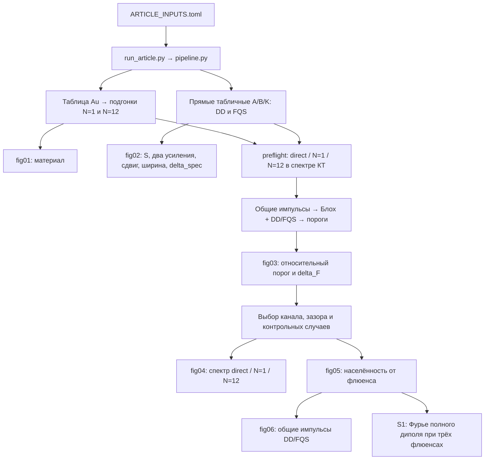

# Сверка статьи, математических ядер и выполненного расчёта

Дата: 22 сентября 2026 г. Исходное состояние репозитория: `faf375b`.
Проверен **сохранённый полный прогон** `results/article_single_mnp`, а не
только рисунки или старые протоколы. Математические ядра, входные численные
значения, NPZ и опубликованные в каталоге рукописи PNG не изменены.
Исправлены описание модели, интерпретация результатов и ссылки на источники.

## Контрольная фиксация соответствия статьи полному прогону

Повторная сверка 22 сентября 2026 г. для состояния репозитория
`85264a2a539f14130f309395775258a503ff8e1b` подтверждает: **численные результаты
текущей статьи в `manuscript` соответствуют завершённому полному прогону
`results/article_single_mnp` с учётом округления**, с особенностью записи
одного порога, указанной ниже. Статья относится к основным полуосям
**c=15 нм, a=b=10 нм**, импульсу 20 фс и времени считывания 3600 фс.
Предложенная геометрия c=12,5 нм, a=b=4,5 нм ещё не рассчитывалась.

Идентификаторы проверенного состояния:

- Git tree каталога `manuscript`:
  `52435718c00562f3b0ec5792f37f9a8575b5952c`.
- Fingerprint полного прогона из `manifest.json`:
  `462fc6b95e72277bd28fe6ca5678e3688d06de42797f7ac9ed182d9d97f51392`.
- Статус прогона: `complete`, `smoke=false`.

Все 13 автоматических проверок сохранённых результатов пройдены;
подтверждены хеши 49 исходников и 54 завершённых выходов этапов.
Все 17 рисунков в каталоге рукописи совпали с архивом или, для `fig02e`,
с восстановленным из архивного NPZ рисунком. Дополнительно построчно
сверены входы, таблицы, численные утверждения об усилениях, порогах,
динамике, спектральных экстремумах и сходимости; автоматическая проверка
сама по себе не разбирает численные утверждения LaTeX.

Особенность округления: в `manuscript/results.tex`, таблица порогов,
канал «бок, поперёк касательно» при g=5 нм записан как **200**, тогда как
`fig03_master_a146b63990.npz` даёт **199,4612384074** в единицах
10⁻⁶ Дж/см². Разница составляет 0,27%; при округлении до трёх значащих
цифр следует писать **199**. Это грубое округление не меняет выводов;
в зафиксированном состоянии статьи сохранена исходная запись 200.

Эта фиксация документирует соответствие текста сохранённому расчёту,
а не новый полный прогон или дополнительную физическую валидацию модели.
Файлы статьи, вычислительные ядра и архивные результаты при ней не изменены.

## 1. Что установлено непосредственно по файлам

`manifest.json` имеет статус `complete`, `smoke=false`;
`numerically_checked_recommendation=true`. Проверены:

- SHA-256 всех **49** исходников из манифеста: совпадают с текущими файлами.
- SHA-256 всех **54** завершённых выходов этапов: совпадают с манифестом.
- Все **16** PNG из списка рисунков прогона побайтно совпадают с копиями
  в `manuscript/figures`.
- Дополнительный `fig02e.png`, отсутствующий в списке runner, побайтно
  воспроизводится штатным plotter из `fig02_master` с `--gain-kind fixed --dpi 200`.
- Из сохранённых A/B/K независимо восстановлены линейный диполь КТ, S(E),
  оба усиления, δ_spec; из порогов — отношения к изолированной КТ,
  δ_F и отношение N=1/N=12. Формулы дают сохранённые значения.
- Вычитание фона МНЧ воспроизводит все сохранённые Δσ(E;F).

В манифесте есть **три отклонённые попытки**, после которых runner выполнил
разрешённые уточнения: основной спектр с n_max=80 и две подгонки изменённой
формы с N=12. Их наличие не означает отказа окончательного прогона.
Отдельно сохранён отрицательный результат при несущей 2.082 эВ; он не должен
исчезать из интерпретации при положительном общем статусе рекомендации.

Численная таблица сверки создаётся без новых решений ОДУ:

```powershell
.\.venv\Scripts\python.exe -m qdmnp.observables.plot_excitation_gain_gap results\article_single_mnp\data\fig02_master_52d4018a47.npz --gain-kind fixed --dpi 200 --output results\manuscript_audit\fig02e.png
.\.venv\Scripts\python.exe scripts\audit_manuscript_results.py --rebuilt-fixed-gain results\manuscript_audit\fig02e.png
```

Результат: `results/manuscript_audit/evidence.json`. Проверка хешей намеренно
строга: после изменения вычислительных исходников она сообщит несовпадение,
даже если изменение не влияет на физику. Сами результаты она не перезаписывает.

## 2. Математическое ядро: входы, выходы и зависимости

В атомных единицах внешнее поле и диполь КТ определяют

\[
p_M=A E_{inc}+B\mu_d,\qquad E_{MNP}=B E_{inc}+K\mu_d.
\]

A — диполь МНЧ от однородного поля; B — взаимная перекрёстная связь;
K — поле, которое диполь КТ создаёт у себя через отклик МНЧ.
Это пять отдельных скалярных задач с заданным направлением перехода КТ,
а не произвольная трёхмерная тензорная задача и не ориентационное усреднение.

| Блок | Реализация | Что проверялось |
|---|---|---|
| Входы и единицы | [article_inputs.py](../src/qdmnp/observables/article_inputs.py), `load_inputs`, преобразования входов | Поверхностный зазор, дебаи, эВ/мэВ/нэВ, γφ и Γ₂, флюенс в среде |
| Материал и DD | [rational_fit.py](../src/qdmnp/rational_fit.py), `MaterialDispersion`, `HybridQDPlasmonModel`, `interaction_factor`, `rhs` | Интерполяция n,k; поляризуемость; знак связи; Блох; мгновенный член α∞ |
| Осевой FQS | [spheroid_green.py](../src/qdmnp/spheroid_green.py), `SpheroidGreenInteraction` | Ряд n при фиксированном m=0 или m=1, сферический предел |
| Боковой FQS | [spheroid_equatorial.py](../src/qdmnp/spheroid_equatorial.py), `_enumerate_modes`, `_initialize_prolate`, `_bright_coupling` | n,m и сектор cos/sin, чётность, веса, светлая связь |
| FQS во времени | [full_qs_model.py](../src/qdmnp/full_qs_model.py), `modal_susceptibility_from_fit`, `_evaluate_state_unchecked`, `_rhs_unchecked` | Общая материальная подгонка; обратная связь; поле на КТ и диполь МНЧ |
| Редукция | [modal_reduction.py](../src/qdmnp/modal_reduction.py), `build_positive_dark_reduction` в `full_qs_model.py` | Положительные веса тёмных мод, сохранение светлой моды, проверка ошибки |
| Независимая пространственная сверка | [qd_mnp_bem_validation.py](../qd_mnp_bem_validation.py), [тесты](../tests/test_spheroid_bem_validation.py) | Независимость BEM, происхождение фикстуры, пять каналов и сферический предел |

### DD

\[
C=\varepsilon_m a^2c/3,\quad
J=\frac{3(\mathbf e\cdot\widehat{\mathbf R})^2-1}{\varepsilon_m R^3},\quad
A=C\alpha_L,\quad B=AJ,\quad K=AJ^2.
\]

Знак определяется углом к **линии центров**, а α_L — направлением относительно
**оси сфероида**. Эти два признака нельзя подменять друг другом.
G=2 у `axis_long`, `side_trans_radial`; G=-1 у остальных трёх каналов.
Именно это исправлено в статье: её прежнее правило «продольный ⇒ G=2»
неверно для `side_long`.

### FQS

Ваше замечание подтвердилось. В общем реализованном ряде

\[
K_h=\sum_{\nu=(n,m,s)\in\mathcal M_h}w^{(h)}_\nu\chi_{nm},\qquad
\chi_{nm}=\frac{\varepsilon_p-\varepsilon_m}
 {\varepsilon_m+L_{nm}(\varepsilon_p-\varepsilon_m)}.
\]

| Канал | Допустимые m при каждом n | Сектор |
|---|---|---|
| `axis_long` | m=0 | cos |
| `axis_trans` | m=1 | cos, выбор одной эквивалентной поперечной оси |
| `side_long` | 0≤m≤n, n+m нечётно | cos |
| `side_trans_radial` | 0≤m≤n, n+m чётно | cos |
| `side_trans_tangential` | 1≤m≤n, n+m чётно | sin |

Геометрические веса неотрицательны и зависят также от поляризации и ε_m.
Сумма только по n была достаточна для осевой реализации, но не описывала
экваториальную реализацию. При этом код не поддерживает произвольную точку
вне этих симметричных положений: расширение индекса не означает такого API.

Однородное поле связано с единственной светлой гармоникой данного канала:
n=1, m=0 для поля вдоль z, m=1 для поперечного поля. Для неё

\[
A=CH,\quad B=CJ_bH,\quad K_b=CJ_b^2H=B^2/A.
\]

У вытянутого сфероида J_b≠J при конечном R. Следовательно,
**FQS с n_max=1 не тождественна DD**: разница включает не только добавление
тёмных порядков, но и точную пространственную форму светлой гармоники.

Материальные осцилляторы имеют другой индекс k=1,…,N. Для каждой ориентации
отдельно подгоняется H=α_L; затем

\[
\chi_{nm}=H/[1+(L_{nm}-L_b)H].
\]

Временная реализация этой дроби приведена в новой редакции методов:
внутренняя сила vν содержит алгебраическую обратную связь и α∞,
каждый qνk удовлетворяет уравнению затухающего осциллятора.
В производственном расчёте тёмная часть редуцирована и для осевых,
и для боковых каналов. Узлы редукции нельзя отождествлять с конкретными (n,m).
Для `fig06_dynamics_near`, `axis_long` сохранены 160 исходных гармоник
и 17 динамических мод (светлая и 16 тёмных). На независимой частотной сетке
из 1601 точки NRMS редукции равна 5.6286×10⁻⁷, максимальная нормированная
ошибка — 9.3754×10⁻⁷; повторная проверка передаточной функции также пройдена.
Это частотный сертификат. Уточнение 160→320 сохраняет редукцию;
отдельного прямого сравнения нелинейных порогов с нередуцированной системой
в сохранённом прогоне нет. Оно не выдаётся за выполненную проверку.

### КТ и физический смысл нелинейной связи

В обоих ядрах одинаковы P=2 Re ρ_ge, Q=-2 Im ρ_ge, W=ρ_ee−ρ_gg,
Ω=2d f_loc(E_inc+E_MNP), μ_d=f_loc dP и ρ_ee=(1+W)/2.
Начальные условия: основное состояние КТ и нулевой отклик металла.
Здесь f_loc=1, поэтому фоновая ε_QD=6 не меняет расчёт.

γ₁ и Γ₂ фиксированы. Поле Kμ_d учитывает когерентное обратное действие
поглощающего металла, но при нулевой когерентности и отсутствии возбуждения
металла остаётся dρ_ee/dt=−γ₁ρ_ee. Из него нельзя получить геометрически
зависимое спонтанное тушение или квантовый выход люминесценции.

## 3. Тракт построения рисунков



| Наблюдаемая / рисунок | Реализация и артефакт | Важная конвенция |
|---|---|---|
| α и 1/α, fig01 | `calculate_material_dispersion_comparison.py`, `fig01_material_*.npz` | 801 узел для показанных ошибок; 22 исходные точки в окне подгонки, сгущённая интерполяция для fit |
| S, усиление, сдвиг, ширина, δ_spec, fig02 | `gap_metrics_common.compute_spectral_payload`, `_spectral_metrics`, `fig02_master_*.npz` | **Прямой табличный материал** в обоих ядрах, не N=12; 4001 энергия |
| Резонанс и ширина | `spectral_features.extract_feature` | Ближайший достоверный пик, параболическая энергия, ширина на половине проминенции, отбрасывание неоднозначных/обрезанных пиков |
| Предварительная проверка и fig04 | `calculate_excitation_spectrum_material_comparison.py`, `preflight_g0.5_*.npz` | Прямой материал — эталон подгонки внутри QS; при g=0.5 нм NRMS S для N=12 составляет 0.22–1.02 % по пяти каналам |
| Порог и δ_F, fig03 | `gap_metrics_common._bracket_threshold`, `compute_threshold_payload`, `fig03_master_*.npz` | Первая возрастающая ветвь, поиск в √F, Брент; t_read=3600 фс |
| P_exc(F), fig05 | `calculate_excitation_fluence_material_comparison.py`, `threshold_metrics.py`, `fig05_material_fluence_*.npz` | 129 флюенсов, интерполяция в √F; ветви one/multi; одинаковое время считывания |
| ρ_ee(t), fig06 | `calculate_population_dynamics.py`, `fig06_dynamics_{near,far}_*.npz` | Один общий флюенс, равный ближнему порогу FQS, для ближнего и дальнего случаев |
| σ и Δσ, S1 | `calculate_work_loss_spectrum_material_comparison.py`, `supp01_work_spectrum_*.npz` | Фиксированная несущая; Фурье одной траектории для каждого F; 8001 энергия, конец окна 12000 фс |
| Ранжирование и чувствительность | `pipeline.select_scenarios`, `compare_thresholds`, `assess_recommendation_ranking` | Основная карта всех кандидатов; дополнительные проверки выбранных каналов при одном номинальном зазоре |

Все указанные калькуляторы находятся в [observables](../src/qdmnp/observables).
Plotter-ы используют сохранённые массивы. Полное определение импульса включает
множитель n_m=√ε_m в падающем флюенсе и точную поправку вещественной гауссианы.
Линейная формула β(1+B)/(1−βK), определения усилений и интегральная норма
δ_spec совпали с независимо пересчитанными массивами.

## 4. Сравнение чисел и выводов статьи

### Подтверждённые результаты

| Величина | Результат по NPZ |
|---|---:|
| Порог изолированной КТ | 6.167216446×10⁻⁵ Дж/см² |
| FQS, `axis_long`, g=0.5 нм | 1.350025564×10⁻⁶ Дж/см²; выигрыш 45.6822 |
| FQS, `axis_long`, g=1 нм | 1.620103930×10⁻⁶ Дж/см²; выигрыш 38.0668 |
| DD/FQS по порогу, g=1 нм | 2.39180 |
| N=1/N=12 по порогу FQS, g=0.5 нм | 7.74387 |
| Максимальное различие населённостей N=1 и N=12 | около 0.868 |
| Фиксированный gain FQS, g=1 нм: пять каналов в порядке TOML | 25.2548; 0.06557; 2.18689; 4.73346; 0.01332 |
| `axis_long`: наибольший фиксированный gain на сетке | 25.4681 при g=1.5 нм |
| Тот же канал: gain с перестройкой при g=0.5 нм | 38.0436 |
| δ_spec у лидера, g=0.5 → 12 нм | 0.694223 → 0.156720 |
| δ_F у лидера, g=0.5 → 12 нм | 1.52608 → 0.186144 |
| Ближняя динамика: FQS / DD / изолированная КТ | 0.500001 / 0.225864 / 0.0135135 |
| Дальняя динамика: FQS / DD | около 0.0460 / 0.0388 |

Таблица качества материала и таблица порогов в рукописи согласуются с NPZ
в пределах указанного округления. Спектральные границы DD для
`axis_trans`, `side_trans_radial`, `side_trans_tangential` равны 10, 10, 7 нм.
Для них совпали и пороговые границы; это результат конкретного прогона,
а не тождество δ_spec=δ_F. У `axis_long` и `side_long` границы не установлены.

Степенная аппроксимация δ_spec при g≥3 нм у лидера действительно даёт
p=2.96561 и максимальную относительную невязку 3.4893 %. Экстраполяция
δ_spec=0.1 даёт R=34.0912 нм, за объявленным пределом R≈29.4 нм.
Это экстраполяция пяти дискретных точек, а не доказанный дальний закон
или результат расчёта запаздывания. Предсказанные зазоры трёх контрольных
каналов 9.019, 9.158, 6.853 нм также воспроизведены.

### Исправленные расхождения и чрезмерные обобщения

1. **FQS:** вместо общей суммы только по n введены (n,m,s), правила отбора,
   светлая мода, L_nm, общая материальная обратная связь и явные ADE.
2. **DD:** исправлен геометрический множитель для боковых каналов;
   разделены J и J_b. Введены полные, складывающиеся формулы A/B/K.
3. **Материал:** указано, что карта слабополевых спектров использует direct,
   а импульсные карты — общую подгонку. Продольный и поперечный fit различны.
   Раздельное варьирование материала и пространственного ядра не доказывает
   аддитивность их ошибок или отсутствие взаимодействия приближений.
4. **Сходимость:** устаревшее «80 против 40» заменено фактическим «160 против 320»;
   уточнены различающиеся способы определения порогов в fig03 и fig05.
5. **Положение максимума:** утверждение о 1.25–1.5 нм заменено установленным
   максимумом среди узлов при 1.5 нм. Узла 1.25 нм в сохранённой карте нет.
6. **5-процентное плато:** это консервативное правило перекрытия интервалов
   F(1±0.05), а не фактическая ошибка решателя. Оно объединяет два узла,
   не удостоверяет непрерывный интервал оптимума и не является статистикой.
7. **Сравнение δ_F и δ_spec:** утверждение о большем пороговом расхождении
   ограничено ведущим каналом. В других каналах оно в общем неверно.
8. **Чувствительность:** варьируется γφ, а не непосредственно Γ₂.
   Максимальные изменения порогов при двух знаках вариации равны 1.861 % и
   1.040 %. Проверены три канала при номинальном g=0.5 нм, не вся новая карта.
   Не заявляется устойчивость положения оптимума по всему диапазону зазоров.
9. **Политики контроля:** N=1 — намеренно неточная диагностическая ветвь;
   проверки вариаций формы имеют отдельно заданные более мягкие допуски.
   Отказ при 2.082 эВ сохранён и не включён в gate ранжирования при 2.042 эВ.
10. **S1:** положительный максимум, максимальный модуль и полный размах
    теперь явно различаются, исправлен фон на энергии слабополевого максимума.

Для последнего пункта значения Δσ при N=12, в единицах 10⁻¹² см²:

| Флюенс, Дж/см² | max Δσ | min Δσ | max\|Δσ\| | max−min |
|---|---:|---:|---:|---:|
| 5×10⁻¹⁰ | 3.209876 | −0.459867 | 3.209876 | 3.669743 |
| 1.350029337×10⁻⁶ | 2.126674 | −0.403480 | 2.126674 | 2.530155 |
| 4.487045649×10⁻⁶ | 0.183738 | −0.408507 | 0.408507 | 0.592245 |

Отсюда снижение слабое/сильное поле составляет **17.47** по положительному
максимуму, **7.86** по максимальному модулю, **6.20** по размаху.
Прежнее «особенность уменьшается в 18 раз» относилось лишь к первой метрике.
Фон МНЧ на энергии слабополевого положительного максимума равен
6.72308×10⁻¹² см², а не 6.9×10⁻¹². Наличие отрицательной Δσ не означает
активный металл: это разность откликов двух пассивных связанных задач.

## 5. Проверки и границы выводов

Полный существующий набор: **392 теста, OK**, включая DD/FQS, сферический
предел, экваториальные гармоники, BEM-происхождение, временно-частотные
сопоставления, единицы и вычислительный тракт статьи.
Автоматическая сверка сохранённых результатов: **13 проверок пройдено**.
PDF статьи собран `pdflatex` с повторным проходом для ссылок; все 18
библиографических записей используются, неопределённых ссылок нет.
Формулы FQS и таблица экстремумов проверены также в отрисованном PDF.

Сохранённые изменения порогов при уточнении выбранных конфигураций:
пространственный порядок 160→320 — 3.55×10⁻¹⁵;
сетка флюенса — 4.01×10⁻⁶;
шаг/допуски времени — 3.62×10⁻⁷;
N=12→13 — 2.88×10⁻⁴. Различие ближнего порога между fig03 и fig05:
2.7954×10⁻⁶. Это численная воспроизводимость внутри заданных уравнений.

Отдельными вопросами остаются физическая точность локальной квазистатики,
конечный размер КТ, поверхностное затухание, некогерентный распад,
туннелирование и реалистичная форма наночастицы. Независимый BEM имеет
значительную неопределённость K на малых расстояниях и не удостоверяет
процентную точность FQS для каждого самого малого зазора. Успех тестов,
сходимость или положительность матрицы плотности этих ограничений не снимают.

Полный тяжёлый прогон не повторялся: проверенные сохранённые расчёты и рисунки
согласованы с неизменённым вычислительным кодом. Источники физических входов
и различие между прямым заимствованием и оценкой масштаба собраны в
[PHYSICAL_PARAMETER_SOURCES.md](PHYSICAL_PARAMETER_SOURCES.md).
