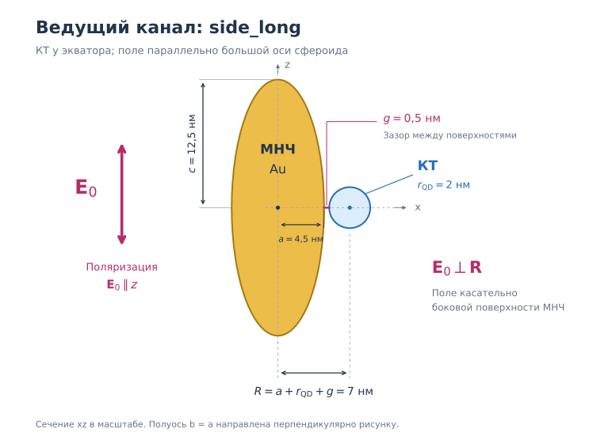
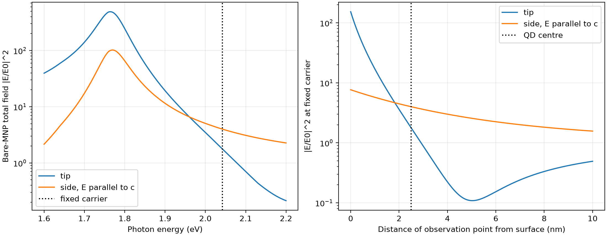

# Почему боковой продольный канал опережает канал у вершины

Проверка от 23.09.2026 для `results/article_single_mnp_c12p5_a4p5`.
Это проверка существующей модели и интерпретации результатов. Физические
параметры, математические ядра и исходные результаты полного прогона не менялись.

**Вывод:** преимущество `side_long` при заданной несущей согласуется с точным
квазистатическим полем сфероида. У вершины сильнее рассеянное поле, но в центре
КТ оно частично компенсирует падающее поле. Сбоку интерференция конструктивная.
На самой поверхности поле у вершины по-прежнему больше. Строгий аналитический
результат ниже относится к полю возбуждения; нелинейный порог проверяется отдельно.

## Что именно сравнивается

Полуоси золотого сфероида: `c=12.5 nm`, `a=b=4.5 nm`; ось `z` направлена вдоль
`c`. Окружение: `eps_m=2.25`. Радиус КТ `r_QD=2 nm`, поверхностный зазор
`g=0.5 nm`. В обоих каналах внешнее поле и переходный диполь КТ направлены вдоль
`z`. Различается положение центра КТ:

- `axis_long`: `(0, 0, 15) nm`, у вершины;
- `side_long`: `(7, 0, 0) nm`, у экватора, поле касательно поверхности.



В названии `side_long` продольной является поляризация относительно большой
оси МНЧ: `E_0` параллельно `z` и перпендикулярно вектору между центрами `R`.

Центр КТ находится на расстоянии `d=r_QD+g=2.5 nm` от поверхности металла,
а не на расстоянии `g`. Несущая и переход КТ остаются равными `2.042 eV`;
длительность гауссова импульса по полувысоте интенсивности — `20 fs`.
Порог — первое достижение `rho_ee(t_read)=0.5` при `t_read=3600 fs` на первой
возрастающей ветви зависимости от флюенса, до первого разрешённого максимума Раби.

| Величина | У вершины, `axis_long` | Сбоку, `side_long` |
|---|---:|---:|
| Поле рассеяния `B=E_sc/E_0` при несущей | -2.110295 + 0.736711 i | 0.970331 - 0.338746 i |
| Интенсивность рассеянного поля `abs(B)^2` | 4.99609 | 1.05629 |
| Интенсивность полного поля голой МНЧ `abs(1+B)^2` | 1.77550 | 3.99695 |
| Усиление населённости после слабого импульса, FQS | 1.24966 | 3.78410 |
| Исходный порог FQS, мкДж/см² | 49.22924 | 16.07525 |

Порог изолированной КТ — `61.67216 мкДж/см²`. Поэтому выигрыш бокового канала
относительно изолированной КТ равен `3.8365`, а отношение порогов
`F_tip/F_side=3.0624`. Это разные отношения. Оба исходных порога имеют статус
`resolved_refined`. Лидер выбран среди пяти исследованных каналов и сетки
зазоров; глобальная оптимальность по всем положениям и ориентациям не доказана.

## Независимое точное решение для поля возбуждения

Здесь рассматривается однородный сфероид без обратного действия КТ, в локальном
квазистатическом приближении. Использована исходная табличная диэлектрическая
функция золота, без её рациональной аппроксимации. Это отдельная проверка `B`,
которая не использует сфероидальные функции проекта.

Для внешней точки определим конфокальную координату `lambda >= 0`:

\[
\frac{x^2+y^2}{a^2+\lambda}+\frac{z^2}{c^2+\lambda}=1.
\]

Положим

\[
I(\lambda)=\int_\lambda^\infty
\frac{ds}{(a^2+s)(c^2+s)^{3/2}},\qquad
L_z=\frac{a^2c}{2}I(0),
\]

\[
D=\varepsilon_m+L_z(\varepsilon_p-\varepsilon_m),\qquad
\chi=\frac{\varepsilon_p-\varepsilon_m}{D},\qquad
C=\frac{a^2c}{2}\chi.
\]

`epsilon_p` — комплексная диэлектрическая проницаемость золота при выбранной
энергии; `L_z` — продольный фактор деполяризации; `chi` здесь обозначает
безразмерный отклик однородного эллипсоида. Внешний и внутренний потенциалы:

\[
\frac{\Phi_{\rm out}}{E_0}=-z+CzI(\lambda),\qquad
\frac{\Phi_{\rm in}}{E_0}=-\frac{\varepsilon_m}{D}z.
\]

Они удовлетворяют уравнению Лапласа, однородному полю на бесконечности,
непрерывности потенциала и нормальной компоненты электрической индукции на
поверхности. В частности, `1-L_z chi=epsilon_m/D`; нормальная производная
внешнего потенциала на поверхности равна `-E_0 epsilon_p n_z/D`, внутреннего —
`-E_0 epsilon_m n_z/D`, где `n_z` — компонента единичной нормали. Поэтому
`epsilon_m d_n Phi_out=epsilon_p d_n Phi_in`. Единственность пассивной
электростатической краевой задачи фиксирует решение. Это полное решение
возбуждения однородным полем, без замены сфероида точечным диполем.

Дифференцирование потенциала даёт `H=E_z/E_0`:

\[
H_t=1+C\left[\frac{2}{(a^2+\lambda_t)R_t}-I(\lambda_t)\right],
\quad R_t=c+d,\quad\lambda_t=R_t^2-c^2,
\]

\[
H_s=1-CI(\lambda_s),
\quad R_s=a+d,\quad\lambda_s=R_s^2-a^2.
\]

Для текущих входных данных

\[
\varepsilon_p=-9.95063216+1.46338382i,\quad
L_z=0.1193387899,\quad
\chi=-14.27044336+4.98185797i.
\]

Запишем `H_t=1+b_t chi`, `H_s=1-b_s chi`, где положительные геометрические
коэффициенты равны `b_t=0.1478787555`, `b_s=0.0679958614`. Тогда

\[
|H_s|^2-|H_t|^2=(b_t+b_s)
\left[-2\operatorname{Re}\chi-(b_t-b_s)|\chi|^2\right]
=2.22145435>0.
\]

Таким образом, превосходство бокового **полного поля** в заданных точках
следует непосредственно из аналитического решения. Если бы падающее и
рассеянное поля складывались синфазно, рост рассеянного поля означал бы рост
полного. Здесь существенны комплексная фаза отклика и противоположные знаки
геометрических коэффициентов.
Численное интегрирование `I` и рабочие сфероидальные ядра дают относительное
различие `H` меньше `2.4e-14`. Дополнительно проверены граничные формулы,
сферический предел и нулевой диэлектрический контраст.

## Почему это не противоречит усилению у острия

На поверхности, со стороны диэлектрика,

\[
H_t(0)=\frac{\varepsilon_p}{D},\qquad
H_s(0)=\frac{\varepsilon_m}{D}.
\]

При несущей `2.042 eV` интенсивности равны **153.054** у вершины и **7.65977**
у экватора. Обычное усиление у острия сохраняется. При удалении от поверхности
меняются амплитуда рассеянного поля и его интерференция с падающим. Профили
полного поля пересекаются при `d=1.82437 nm`; центр КТ расположен дальше,
при `d=2.5 nm`.

Частота также существенна. При энергии `1.768625 eV`, вблизи нового продольного
плазмонного максимума, в тех же точках получаем `abs(H_t)^2=483.631` и
`abs(H_s)^2=102.066`: у вершины снова больше. Это сравнение полей голой МНЧ;
переход КТ при изменении частоты не переносился. Оно не доказывает улучшения
порога КТ, если изменить только несущую.

Для прежних полуосей `c=15 nm`, `a=10 nm` при исходной несущей `2.042 eV` и
том же `d=2.5 nm` усиления полного поля равны `51.3571` и `3.19335`.
Сохранение несущей при изменении формы существенно изменило фазовое и
спектральное согласование. Одного упоминания сдвига плазмонного максимума
недостаточно для объяснения смены лидера: нужны точка наблюдения и комплексное
полное поле, как в формулах выше.



## Обратное действие КТ и нелинейный порог

В линейном пределе проект решает

\[
E_{\rm QD}=(1+B)E_0+Kp_{\rm QD},\qquad
p_{\rm QD}=\beta E_{\rm QD},\qquad
\frac{p_{\rm QD}}{E_0}=\frac{\beta(1+B)}{1-\beta K}.
\]

`beta` — внешняя поляризуемость КТ с принятой в проекте конвенцией экранирования;
`K` — реакционное ядро МНЧ. При несущей знаменатель `1-beta K` равен
`1.43548-0.82357i` у вершины и `1.05731-0.40610i` сбоку. Монохроматические
усиления дипольного отклика КТ `abs((1+B)/(1-beta K))^2` составляют `0.64826`
и `3.11573`. Это ещё одна проверка знаков и обратного действия, но эти числа
не являются усилениями населённости после широкополосного 20-фс импульса.

Исходные импульсные расчёты дают усиления слабой населённости `1.24966` и
`3.78410`, а пороги — `49.22924` и `16.07525 мкДж/см²`. Порог вычисляется
интегрированием нелинейной системы, а не делением изолированного порога на
усиление поля. Реакционное ядро не следует автоматически интерпретировать
как рассчитанный в этой модели фактор Парселла или скорость спонтанного
излучения/тушения флуоресценции.

У исходного полного прогона проверки порогов с увеличенными `N`, пространственным
порядком и временным разрешением покрывали `side_long` и `side_trans_radial`.
Они не являлись отдельной проверкой сходимости порога `axis_long`.
Поэтому для этого аудита выполнено уточнение обоих сравниваемых каналов при
`N=13` вместо `12`, `n_max=160` вместо `80`, `rtol=1e-8`, `atol=1e-10` и
`points_per_fastest_cycle=16` вместо `8`, без изменения физических параметров.
Сохраняется штатная положительная редукция тёмных мод (`dark_reduction=all`);
`n_max` обозначает порядок исходного пространственного ядра, а не количество
независимых осцилляторов во временном интеграторе.

| Канал | Исходный порог, мкДж/см² | Уточнённый порог, мкДж/см² | Изменение |
|---|---:|---:|---:|
| `axis_long` | 49.229235 | 49.206879 | -0.04541% |
| `side_long` | 16.075251 | 16.073699 | -0.00966% |

Оба порога снова `resolved_refined`; отношение `F_tip/F_side=3.06133`,
выигрыш бокового канала относительно изолированной КТ — `3.83684`.
Для всех 19 интегрирований FQS, использованных в поиске порогов, подтверждены
успешное достижение конца интервала, конечность состояния, затухание хвостов
и неотрицательность работы в установленном допуске. Минимальное собственное
значение матрицы плотности не ниже `-4.5e-16`. Максимальный относительный хвост
равен `0.00176` при допуске `0.01`; максимальная спектральная утечка — `1.15e-5`
при допуске `0.001`. Пространственный, модальный и устойчивостный критерии,
а также критерий разрешения первой ветви приняты. В DD канал у вершины остался
`right_censored`: цель не достигнута до верхнего исследованного флюенса;
это не разрешённый порог и в приведённые отношения не входит.

Сходимость при уточнении не является оценкой полной погрешности физической
модели или материальной аппроксимации. Отдельно сопоставлен частотный отклик
временной модели `N=13` с нередуцированным ядром `n_max=160` и табличным золотом.
При несущей относительное отличие `B` равно `0.0493%`, отличие `K` — `0.0574%`
у вершины и `0.0195%` сбоку. В более широком диапазоне `1.85–2.234 eV`
максимальное отличие комплексного линейного отклика КТ достигает `11.01%`
и `3.58%` соответственно. Поэтому изменение порога на `0.05%` нельзя
выдавать за строгую границу его абсолютной точности.

Итоги записаны в `tip_side_audit/threshold_comparison.json` и
`frequency_fit_check.json`. Статус и команда расчёта находятся в
`threshold_receipt.json`, исходные численные данные — в `thresholds_refined.npz`.

## Независимая гранично-элементная проверка

`qd_mnp_bem_validation.py` решает декартову поверхностную задачу без импорта
сфероидальных ядер. Для обоих положений выполнены расчёты на вложенных сетках
320, 1280 и 5120 треугольников с последующей экстраполяцией.

| Показатель | У вершины | Сбоку |
|---|---:|---:|
| Экстраполированное `abs(1+B)^2` | 1.73973 | 3.94698 |
| Отличие экстраполированного `B` от точного ядра | 2.59% | 3.86% |
| Отличие экстраполированного `K` от ядра | 2.84% | 0.57% |
| Оценка относительной неопределённости BEM для `B` | 13.81% | 20.77% |
| Оценка относительной неопределённости BEM для `K` | 6.57% | 4.05% |
| Ошибка взаимности на самой мелкой сетке | 11.95% | 6.65% |

Это независимое качественное подтверждение знаков и порядка величин.
Остаточная сеточная ошибка заметна: нельзя выдавать близость экстраполированных
значений за сертифицированную точность BEM в 3–4%. Малые невязки линейных
систем сами по себе такой точности также не доказывают. Для `B` аналитическая
проверка выше значительно сильнее; независимая строгая оценка ошибки полного
нелинейного порога здесь не получена.

## Что подтверждает литература

- Křápek et al., *Plasmonic lightning-rod effect*, препринт (2024),
  [arXiv:2407.09454](https://arxiv.org/abs/2407.09454).
  Авторы выделяют влияние кривизны, отдельно учитывая пространственное затухание
  и возбуждение плазмона. Сравнение выполняется на продольном резонансе, причём
  исследуемое индуцированное поле не включает поле возбуждающего электрона.
  Поэтому результат об усилении у острия нельзя без дополнительных условий
  переносить на наше полное поле при фиксированной нерезонансной несущей.
- Xia et al., *Turning a hot spot into a cold spot: polarization-controlled
  Fano-shaped local-field responses probed by a quantum dot*,
  **Light: Science & Applications 9, 166 (2020)**,
  [DOI:10.1038/s41377-020-00398-1](https://doi.org/10.1038/s41377-020-00398-1).
  Эксперимент с КТ в зазоре золотой наноантенны показывает подавление локального
  возбуждения интерференцией. Геометрия — димер стержней и управление
  поляризацией; это подтверждение роли фаз, а не воспроизведение нашего
  сравнения вершины и экватора одного сфероида.
- Esmann et al., *Vectorial near-field coupling*,
  **Nature Nanotechnology 14, 698–704 (2019)**,
  [DOI:10.1038/s41565-019-0441-y](https://doi.org/10.1038/s41565-019-0441-y),
  [авторский препринт](https://arxiv.org/abs/1801.10426).
  Эксперимент с золотым наностержнем демонстрирует зависимость ближнеполевого
  взаимодействия от ориентации, расстояния и спектральной расстройки. Это
  обоснование необходимости векторного отклика, а не подтверждение числа 3.84.

Работы с точно нашими параметрами, формой и определением импульсного порога
в рамках этого поиска не найдены. Количественное обоснование нашего результата
дают собственные аналитическая и численные проверки.

## Границы вывода и воспроизведение

Проверка относится к локальной квазистатической модели однородного сфероида с
точечным переходным диполем КТ. Она не устанавливает точность приближения
реального цилиндра сфероидом, не проверяет конечный размер КТ, нелокальный
отклик металла, туннелирование или перенос заряда. Здесь зазор составляет
`0.5 nm`, а радиус кривизны вершины `a^2/c=1.62 nm`; поэтому количественное
перенесение результата на эксперимент требует отдельного обоснования.

Исходный `ranking_validation.accepted=false` также не исправляется этим
аудитом: проверки `c_low`, `a_high` и `gap_low` остаются незавершёнными из-за
критериев качества аппроксимации/сходимости. Устойчивость к этим вариациям
нельзя считать доказанной на основании проверки номинальной пары каналов.

Нижняя граница основной сетки `g=0.5 nm` не выведена как универсальная
граница применимости. Зазоры 0.5 и 0.75 нм уже субнанометровые. Ядра требуют
`g>0`, а `locality_advisory_gap_nm=1.0` служит оговоркой, не фильтром.
Проверка чувствительности при 0.3 нм запускалась и была отклонена критерием
сходимости ряда; это не доказательство физической невозможности такого зазора.
Расстояние точечного источника от металла равно `r_QD+g`: 2.5 нм при
`g=0.5 nm` и 2.2 нм при `g=0.2 nm`.

Дальнейшее уменьшение зазора полезно для изучения сходимости, насыщения и
зависимости вывода от границы сетки внутри модели. Количественный прогноз
для реальной системы требует отдельно обосновать отсутствие переноса заряда,
учёт оболочек и локальность отклика; уточнение ряда и интегратора этого не
заменяет. Экспериментальная зависимость переноса электронов от разделяющего
слоя исследована для CdSe–золото у
[Bakkers et al. (2000)](https://research.tue.nl/en/publications/distance-dependent-electron-transfer-in-auspacerq-cdse-assemblies/).
Влияние нелокальности на тесно сближенные металлические структуры показано у
[Ciracì et al., Science (2012)](https://pmc.ncbi.nlm.nih.gov/articles/PMC3649871/).
Эти работы не устанавливают точную границу допустимых зазоров для нашего образца.

В новой основной карте порог `side_long` при 1 нм равен
`17.57880 мкДж/см²`, при 1.5 нм — `19.18854 мкДж/см²`: увеличение относительно
0.5 нм составляет 9.35% и 19.37%. Эти точки позволяют обсуждать сохранение
выигрыша при отступлении от нижней границы сетки. Само значение 1 нм также
не удостоверяет точность всех физических приближений.

Связь с реализацией: `gap_metrics_common._resolved_center_distance_nm` задаёт
положения, `_build_channel` создаёт ядро, `_solve_population` возвращает
населённость в общий момент считывания, `_bracket_threshold` ищет первый
порог. `SpheroidGreenInteraction.response_from_epsilon` и
`EquatorialSpheroidGreenInteraction.response_from_epsilon` вычисляют `A,B,K`;
`FullQSSpheroidPulseModel` переносит этот отклик во временную задачу.

Скрипт независимого поля и BEM:

```powershell
.\.venv\Scripts\python.exe scripts\audit_tip_side_ranking.py results\article_single_mnp_c12p5_a4p5 --output results\article_single_mnp_c12p5_a4p5\tip_side_audit_repeat --bem
```

Выходная папка должна быть новой. `audit.json` содержит комплексные значения,
результаты всех сеток BEM и SHA-256 исходного артефакта порогов, манифеста и
использованных исходных файлов. `identity_checks.json` содержит проверки
аналитических пределов и совпадения интеграла с его замкнутой формой.
`interpretation_numbers.json` содержит
дополнительные значения на поверхности, при резонансе и для прежней геометрии.
Команда уточнения порогов полностью записана в `threshold_receipt.json`,
исполняемый помощник — `tip_side_audit/check_thresholds.py`.
