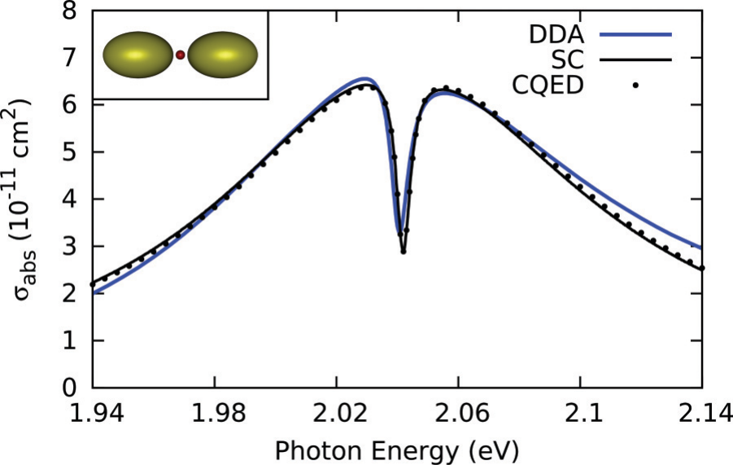
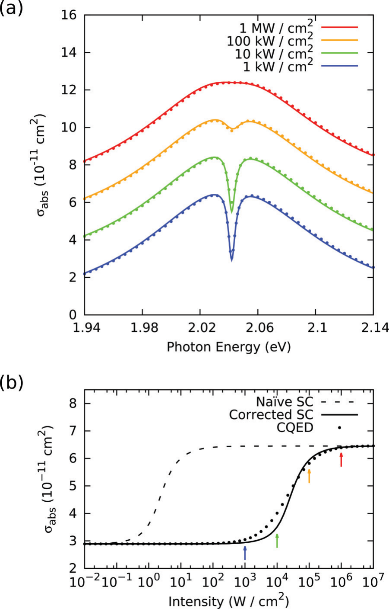
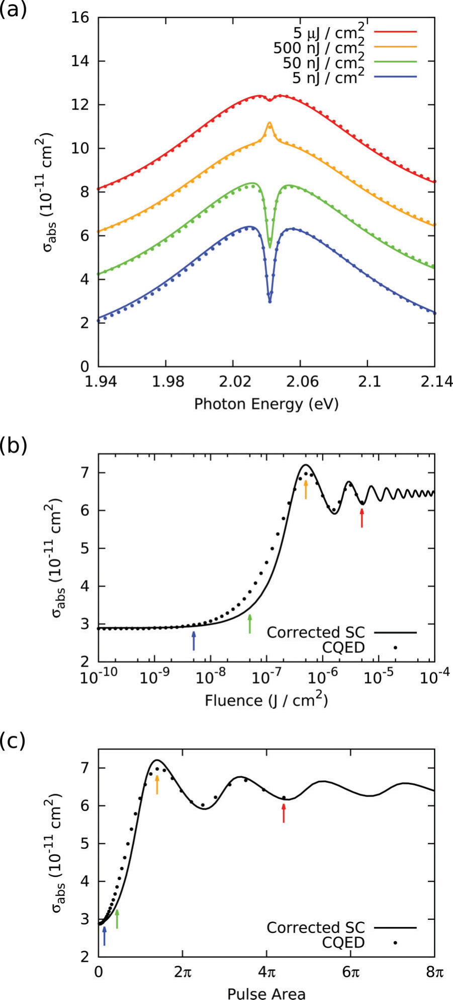
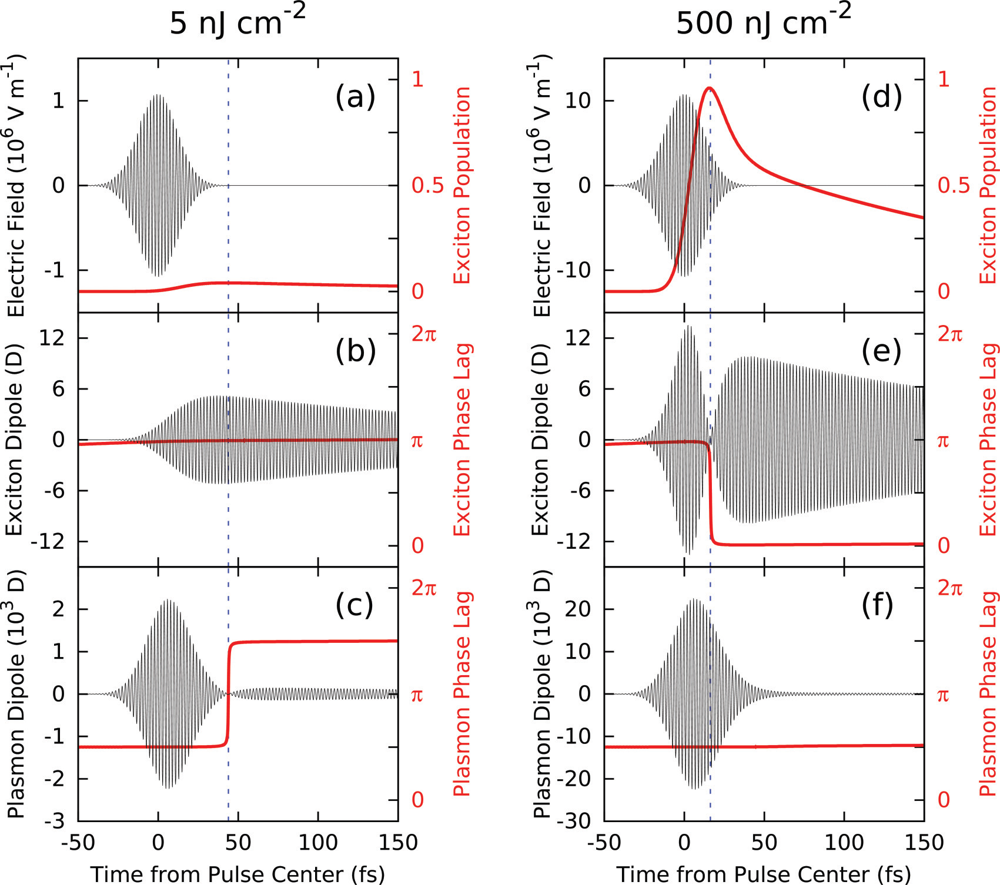

*PHYSICAL REVIEW B 88, 075411 (2013)*

# Ultrafast reversal of a Fano resonance in a plasmon-exciton system

**Raman A. Shah and Norbert F. Scherer**  
*Department of Chemistry and The James Franck Institute, The University of Chicago, 929 East 57th Street, Chicago, Illinois 60637, USA*

**Matthew Pelton and Stephen K. Gray\***  
*Center for Nanoscale Materials, Argonne National Laboratory, 9700 South Cass Avenue, Argonne, Illinois 60439, USA*

*(Received 15 April 2013; revised manuscript received 11 June 2013; published 12 August 2013)*

When a two-level quantum dot and a plasmonic metal nanoantenna are resonantly coupled by the electromagnetic near-field, the system can exhibit a Fano resonance, resulting in a transparency dip in the optical spectrum of the coupled system. We calculate the nonlinear response of such a system, for illumination both by continuous-wave and ultrafast pulsed lasers, using both a cavity quantum electrodynamics and a semiclassical coupled-oscillator model. For the experimentally relevant case of thermal broadening of the quantum-dot transition (to meV values consistent with ∼100 K), we predict that femtosecond pulsed illumination can lead to a reversal of the Fano resonance, with the induced transparency changing into a superscattering spike in the spectrum. This ultrafast reversal is due to a transient change in the phase relationship between the dipoles of the plasmon and exciton. It thus represents a new approach to dynamically control the collective optical properties and coherence of coupled nanoparticle systems.

**DOI:** 10.1103/PhysRevB.88.075411  
**PACS number(s):** 42.50.Pq, 42.50.Ar, 71.35.Cc, 73.20.Mf  
1098-0121/2013/88(7)/075411(7)  
©2013 American Physical Society

## I. INTRODUCTION

A hybrid system of a semiconductor quantum dot (QD) in the near-field of a plasmonic metal nanostructure can exhibit qualitatively different optical properties than its individual components.1–3 For sufficiently strong resonant coupling between the QD exciton and the plasmon, the optical spectrum can exhibit interference:4,5 The QD creates a dramatic “dipole-induced transparency,”6 suppressing absorption and scattering in spite of its relatively small oscillator strength. This interference between spectrally narrow and broad excitations is analogous to the Fano effect in atomic spectroscopy.7 A classical model can describe dipole-induced transparency in the linear response limit. Calculating the nonlinear response of the hybrid system requires that the QD, at least, be modeled quantum mechanically. Semiclassical (SC) models that treat the QD as a two-level system have predicted novel nonlinear-optical effects, including a “nonlinear Fano effect” and optical bistability.4,8–11 Treating both the plasmon and QD quantum mechanically further refines the picture,12–16 predicting in particular a suppression of induced transparency, and of bistability, due to additional dephasing not accounted for in SC models.14,17

These phenomena have all been predicted in the regime of very narrow QD linewidths, on the order of 10 μeV, corresponding to liquid-helium temperatures. Although this can be realistic when QDs are coupled to practically lossless components such as photonic-crystal cavities, absorptive heating may render such temperatures infeasible for QDs coupled to plasmonic nanostructures. This is illustrated with the following rough estimate: Treating a nanoantenna with a resonant absorption cross section of $\sigma_{\mathrm{abs}} = 10^{-10}\ \mathrm{cm}^2$ as a pointlike heat source embedded in a glass matrix with a $0.5\ \mathrm{W\,m^{-1}\,K^{-1}}$ thermal conductivity,18 illumination with $100\ \mathrm{kW/cm^2}$ results in 40 K of temperature rise at steady state, even at a distance of 40 nm. We therefore consider here the more experimentally achievable parameter regime of meV QD linewidths, corresponding to temperatures in the range of 50–100 K.

In this regime, we predict a new nonlinear phenomenon for femtosecond pulsed excitation; namely, for particular fluences the Fano resonance reverses, resulting in a coherently enhanced cross section rather than an induced transparency. This is a dynamical analog of the transition from electromagnetically induced transparency to superscattering,19 arising from a transient change in the phase relationship between the QD and the plasmon. It is thus fundamentally different from the nonlinear Fano effect, a steady-state change in the Fano line shape arising from the dependence of the QD-plasmon coupling strength on the incident field intensity.4,13

## II. THEORETICAL METHODS

### A. Cavity quantum electrodynamics model

Our treatment starts with a quantum-mechanical model of the hybrid system. We follow a previously developed cavity quantum electrodynamics (CQED) formalism,4,12,14 extending the previous work to the regime of broader QD linewidths and to consideration of the transient optical response. The underlying basis states are $|qs\rangle$, where $q \in \{0,1\}$ indexes the QD energy levels and $s \in \{0,1,2,\ldots\}$ indexes plasmon energy levels. Lowering and raising operator pairs for the QD and plasmon are $(\hat{\sigma},\hat{\sigma}^{+})$ and $(\hat{b},\hat{b}^{+})$, respectively. The dipole operators are then $\hat{\mu}_q=d_q(\hat{\sigma}+\hat{\sigma}^{+})$ and $\hat{\mu}_s=d_s(\hat{b}+\hat{b}^{+})$, where $d_q$ and $d_s$ are the transition dipole moments of the QD and plasmon, respectively, and the total dipole operator is $\hat{\mu}=\hat{\mu}_s+\hat{\mu}_q$. The evolution of the density operator $\hat{\rho}(t)$ is governed by

$$
\frac{d\hat{\rho}}{dt}=-\frac{i}{\hbar}[\hat{H},\hat{\rho}]+L(\hat{\rho}), \tag{1}
$$

in which $\hat{H}$ is the Hamiltonian for the driven coupled system and $L(\hat{\rho})$ is a Lindblad superoperator providing for dephasing and dissipation. More explicitly,

$$
\hat{H}=\hat{H}_q+\hat{H}_s+\hat{H}_i+\hat{H}_d, \tag{2}
$$

where $\hat{H}_q=\hbar\omega_q\hat{\sigma}^{+}\hat{\sigma}$ is the uncoupled exciton Hamiltonian, $\hat{H}_s=\hbar\omega_s\hat{b}^{+}\hat{b}$ is the uncoupled plasmon Hamiltonian, $\hat{H}_i=-\hbar g(\hat{\sigma}^{+}\hat{b}+\hat{\sigma}\hat{b}^{+})$ describes plasmon-exciton coupling, and $\hat{H}_d=-E(t)\hat{\mu}$ describes driving by an incident electric field $E(t)$. The Lindblad superoperator is given by $L(\hat{\rho})=L_q(\hat{\rho})+L_s(\hat{\rho})$, where12

$$
\begin{aligned}
L_q(\hat{\rho})={}&-\frac{\gamma_1}{2}\left(\hat{\sigma}^{+}\hat{\sigma}\hat{\rho}+\hat{\rho}\hat{\sigma}^{+}\hat{\sigma}-2\hat{\sigma}\hat{\rho}\hat{\sigma}^{+}\right)\\
&-\gamma_2\left(\hat{\sigma}^{+}\hat{\sigma}\hat{\rho}+\hat{\rho}\hat{\sigma}^{+}\hat{\sigma}-2\hat{\sigma}^{+}\hat{\sigma}\hat{\rho}\hat{\sigma}^{+}\hat{\sigma}\right),
\end{aligned}
\tag{3}
$$

describes exciton population relaxation and dephasing with rates $\gamma_1=T_1^{-1}$ and $\gamma_2=T_2^{-1}$, respectively, and

$$
L_s(\hat{\rho})=-\frac{\gamma_s}{2}\left(\hat{b}^{+}\hat{b}\hat{\rho}+\hat{\rho}\hat{b}^{+}\hat{b}-2\hat{b}\hat{\rho}\hat{b}^{+}\right) \tag{4}
$$

describes plasmon dissipation with rate $\gamma_s$.12 In order to solve [Eq. (1)](#eq-1), we define a maximum plasmon excitation number, $N_s$, above which the values of the density matrix elements are negligible. A solution then involves integrating $O(N_s^2)$ coupled ordinary differential equations, or, at steady state, $O(N_s^2)$ coupled algebraic equations. Once a solution is obtained, the total dipole is calculated according to $\mu(t)=\mathrm{Tr}[\hat{\rho}(t)\hat{\mu}]$. More explicit details of the model and numerical calculations may be found in the Supplemental Material.20

### B. Semiclassical model

A computationally simpler approach is a SC or Maxwell-Bloch model, in which the plasmon dipole, $\mu_s(t)$, is treated classically and the QD is treated with Bloch equations21,22 for its reduced density matrix, $\rho^{\mathrm{QD}}(t)$:

$$
\begin{aligned}
\ddot{\mu}_s+\gamma_s\dot{\mu}_s+\omega_s^2\mu_s &= A_s[E+J\mu_q],\\
\dot{\rho}_1 &= \omega_q\rho_2-\gamma_2\rho_1,\\
\dot{\rho}_2 &= -\omega_q\rho_1-\frac{2d_q}{\hbar}[E+J\mu_s]\rho_3-\gamma_2\rho_2,\\
\dot{\rho}_3 &= \frac{2d_q}{\hbar}[E+J\mu_s]\rho_2-\gamma_1^{\mathrm{SC}}(\rho_3+1),
\end{aligned}
\tag{5}
$$

where $E=E(t)$, $\rho_1=2\mathrm{Re}\rho_{01}^{\mathrm{QD}}(t)$, $\rho_2=-2\mathrm{Im}\rho_{01}^{\mathrm{QD}}(t)$, $\rho_3=\rho_{11}^{\mathrm{QD}}(t)-\rho_{00}^{\mathrm{QD}}(t)$, and $\mu_q=d_q\rho_1$. One can relate $A_s$ to the CQED parameters by solving for the steady state of $\mu_s$ with $J=0$,20 giving $A_s=4\omega_s d_s^2/\hbar$. Comparing classical and quantum dipole interaction energies gives $J=\hbar g/(d_qd_s)$.20 [Equations (5)](#eq-5) can be numerically integrated23 with or without transforming to slow variables and applying the rotating wave approximation;20 the results agree for the present problem. The SC model involves the solution of a five-dimensional first-order system of ordinary differential equations regardless of intensity; this is in contrast to the CQED model, which becomes computationally costly for large $N_s$.

A flaw in the SC model is that an excited QD in the dark cannot couple to the plasmon, but does so in CQED via the Purcell effect.12,24–26 With $\omega_q=\omega_s$ and $\gamma_s\gg\gamma_1,\gamma_2$, and $g$, the QD’s effective decay constant is20

$$
\gamma_1^{\mathrm{eff}}=\gamma_1+\frac{4g^2}{\frac{4g^2}{\gamma_s}+\gamma_1+2\gamma_2+\gamma_s}\approx\frac{4g^2}{\gamma_s}. \tag{6}
$$

The “naïve” SC model with $\gamma_1^{\mathrm{SC}}=\gamma_1$ can thus be contrasted with a “corrected” SC model where $\gamma_1^{\mathrm{SC}}=\gamma_1^{\mathrm{eff}}$ accommodates the Purcell effect while ignoring the subtler coherences implicit in the CQED model. As is shown below, the naïve SC model can underestimate this damping by orders of magnitude, which has large implications for the resulting optical properties.

### C. Optical response

Having obtained $\mu(t)$ using either the CQED or SC model, the absorption cross section is calculated as20,27,28

$$
\sigma_{\mathrm{abs}}(\omega)=\frac{k}{\epsilon_0}\mathrm{Im}[\alpha(\omega)], \tag{7}
$$

where $k=\sqrt{\epsilon_{\mathrm{med}}}\,\omega/c$, with $\epsilon_{\mathrm{med}}$ being the relative dielectric constant of the surrounding medium, and

$$
\alpha(\omega)=\frac{\int e^{-i\omega t}\mu(t)\,dt}{\epsilon_{\mathrm{med}}\int e^{-i\omega t}E(t)\,dt}. \tag{8}
$$

For continuous-wave illumination, integration is over an optical cycle after steady state is reached; for pulsed excitation, integration is over the entire time range encompassing nonzero response. It is also possible to calculate scattering cross sections, as detailed in the Supplemental Material.20 For the system studied here we find that the scattering spectra are qualitatively similar to the absorption spectra. However, absorption dominates over scattering by at least an order of magnitude, so we report only absorption below.

From the experimental point of view, the absorption cross section due to a pulsed excitation is obtained in the same way as in absorption spectroscopy with an incoherent light source.29 An ensemble of the studied nanostructures is illuminated with the pulsed laser, and the transmitted light is dispersed with a monochromator. The ratio of the spectrally resolved signals with and without the sample results in a transmission spectrum. One minus this transmission spectrum is an extinction spectrum, which in the present case is dominated by absorption.

### D. Parameter determination

The model parameters are obtained by fitting to spectra for a realistic system calculated with the discrete dipole approximation (DDA),20,30 assuming the metal optical constant data of Johnson and Christy.31 As illustrated in [Fig. 1](#fig-1), two Au prolate spheroids with semimajor and semiminor axes of 15 nm and 10 nm, respectively, are arranged coaxially with a gap of 6 nm. A 4 nm diameter CdSe QD is placed in the center of the gap. The system is embedded in a medium with dielectric constant $\epsilon_{\mathrm{med}}=2.25$, typical of a polymer or glass. The QD dielectric constant is taken to be a Lorentzian function with center frequency chosen to match the plasmon frequency of the metal nanostructure, and with linewidth corresponding to temperatures of 50–100 K.5,20,32 The fitting gives $\hbar\omega_s=2.042$ eV, $d_s=2990$ D, $\hbar\gamma_s=150$ meV; $\hbar\omega_q=2.042$ eV, $d_q=13.9$ D, $\hbar\gamma_2=1.27$ meV; and $\hbar g=10.8$ meV.20 As seen in [Fig. 1](#fig-1), the CQED and SC results are in excellent agreement with each other and in good agreement with the DDA spectrum. The QD spontaneous emission rate is calculated according to $\gamma_1=\omega_q^3\sqrt{\epsilon_{\mathrm{med}}}d_q^2/(3\pi\epsilon_0\hbar c^3)$,33 giving $\hbar\gamma_1=268$ neV or $T_1=\gamma_1^{-1}=2.46$ ns. However, [Eq. (6)](#eq-6) gives $\hbar\gamma_1^{\mathrm{eff}}=3.02$ meV, corresponding to $T_1^{\mathrm{eff}}=218$ fs. This gives a Purcell factor of $1.13\times10^4$ relative to the free-space lifetime, bringing all time scales in the problem into the femtosecond range and showing the dominance of the exciton to plasmon energy transfer mechanism.

**FIG. 1.** (Color online) Linear absorption spectrum of an Au-CdSe-Au hybrid nanoparticle system (illustrated in the inset). Absorption spectra, $\sigma_{\mathrm{abs}}$, are calculated using the discrete dipole approximation (DDA) and the cavity-quantum-electrodynamics (CQED) and semiclassical (SC) models.

## III. RESULTS

### A. Continuous-wave response

We begin by considering continuous-wave or steady-state spectra. [Figure 2](#fig-2) shows that the Fano resonance dip disappears as the incident intensity is increased due to saturation of the QD transition. The corrected SC and CQED models are in excellent quantitative agreement for high and low applied fields. The naïve SC model’s results are gravely in error, but they can be brought into agreement with the corrected SC model by multiplying the incident intensity by the Purcell factor.12,16 This validates the use of the corrected SC model, which is particularly important for simulations at the high intensities for which the computational cost of the CQED calculations becomes prohibitive.

**FIG. 2.** (Color online) (a) Steady-state absorption spectra calculated using the CQED (dots) and corrected SC (solid) model for various incident intensities. Successive spectra are displaced vertically by $2\times10^{-11}\ \mathrm{cm}^2$. (b) Intensity dependence of steady-state absorption cross sections calculated using the CQED, naïve SC, and corrected SC steady-state models, at a photon energy of 2.042 eV. Arrows indicate the intensities at which spectra are plotted in panel (a).

The results for the current system contrast with predictions for systems with narrow QD linewidths; for these systems, the SC formulation gives a deeper transparency than the CQED formulation even in the linear regime, due to quantum-optical dephasing that is ignored by the (corrected) SC model.12 In our system, thermal dephasing dominates over this vacuum-field-induced dephasing. As the field is increased, however, the quantum-optical dephasing increases and eventually becomes comparable to the thermal linewidth, resulting in a small disagreement between our CQED and SC predictions at moderate fields. At $10\ \mathrm{kW/cm^2}$, the corrected SC and CQED models, within 1%, both give a QD population of 0.16. However, the corrected SC absorption cross section is 12.5% lower than the CQED cross section, indicating that the discrepancy is due to dephasing rather than a population difference.

The results also demonstrate an important tradeoff encountered when using plasmonic field enhancements to modify the optical nonlinearity that arises due to saturation of the QD.15 An isolated QD of the type we study here can have its absorption cross section on resonance reduced from ∼$8\times10^{-14}\ \mathrm{cm}^2$ (linear limit) to nearly zero by incident light with sufficiently high intensity. When incorporated in the coupled QD-plasmonic system, this saturation of the QD effectively “turns off” its ability to interfere with the plasmonic system, resulting in an increase of the system cross section to values corresponding to the bare plasmon excitation ([Fig. 2](#fig-2)). In this sense, the interaction between the QD and the plasmonic system enhances the magnitude of the optical nonlinearity that can be obtained. However, high incident intensities are still required to reach saturation and induce this nonlinear response because the plasmonic field enhancement also induces a strong Purcell effect. We take the saturation intensity to be the intensity such that the absorption cross section is halfway between its minimum and maximum values. For the isolated QD, this saturation intensity is $\sim 0.6\ \mathrm{kW/cm^2}$. In the case of the coupled system described by the naïve SC model, which effectively considers only the field enhancement due to the plasmon, the saturation intensity is significantly lower, $\sim 0.003\ \mathrm{kW/cm^2}$. However, the full CQED calculation, or including the Purcell effect as in the corrected SC model, yields a coupled system saturation intensity of $\sim 30\ \mathrm{kW/cm^2}$, four orders of magnitude larger than the naïve SC model and fifty times larger than the isolated quantum dot case. The Purcell effect thus represents a tradeoff that can effectively cancel the field enhancement effect insofar as lowering saturation intensity is concerned. This is similar to the tradeoff that is encountered when enhancing radiative emission rates using plasmonic nanoparticles: Fast emission to plasmonic modes due to strong Purcell effects is accompanied by strong nonradiative damping of plasmons. If the isolated QD has a high-luminescence quantum yield, coupling to the plasmonic nanoparticles will generally have the effect of reducing this quantum yield.1

### B. Ultrafast reversal

We next consider the system response to a Gaussian pulse, $E(t)$, that has a 20 fs full width at half the maximum intensity and a center frequency, $\hbar\omega=2.042$ eV, resonant with the plasmon and exciton. Given sufficient pulse bandwidth, a single time-domain solution of this form can be used to generate a Fourier-transformed spectrum of the system via [Eqs. (7)](#eq-7) and [(8)](#eq-8); the construction of a such spectrum from a transient response is analogous to passing scattered light from a pulsed optical experiment through a monochromator.29

Calculated transient spectra are shown in [Fig. 3(a)](#fig-3). In the low-fluence case, this calculation gives a spectrum identical to the low-intensity steady-state spectrum, which is a consequence of the linear response at low field. Strikingly, however, at certain higher fluences the resonant dip reverses to form a narrow spike, giving enhanced absorption up to 8% greater than the cross section of the bare plasmon. The corrected SC model remains in excellent agreement with the CQED model. [Figure 3(b)](#fig-3) shows the Fourier-transformed cross section on resonance as a function of fluence. For the highest fluences, the required $N_s$ for the CQED model becomes computationally prohibitive. However, both models indicate recurrences of the dip and spike with increasing fluence.

**FIG. 3.** (Color online) (a) Absorption spectra calculated using the CQED (dots) and corrected SC (solid) models, for ultrafast pulsed excitation. Successive spectra, corresponding to varying fluences, are displaced vertically by $2\times10^{-11}\ \mathrm{cm}^2$. (b) Fluence dependence of the absorption cross section for ultrafast pulsed excitation, calculated using the CQED and SC models, at a photon energy of 2.042 eV. (c) Data from panel (b) plotted as a function of pulse area. Arrows indicate the fluences at which spectra are plotted in panel (a).

### C. Physical mechanism

The ultrafast reversals of the Fano resonance arise from the transient phase relationships of the plasmon and QD dipoles with respect to the incident light, as illustrated in [Fig. 4](#fig-4). At the beginning of the incident pulse, as at steady state, the plasmon lags the driving laser by the $\pi/2$ phase difference expected for a resonant oscillator.16 The QD is driven primarily by the plasmon and thus lags the laser by an additional $\pi/2$ phase difference for a total of a $\pi$ phase lag. At low fluence [[Figs. 4(a)–4(c)](#fig-4)], this phase relationship continues until the pulse is complete and the short-lived plasmon has decayed. Then, the longer lived QD, still oscillating with a $\pi$ phase lag relative to the laser, drives the plasmon; the plasmon thus acquires a $\pi+(\pi/2)=(3\pi/2)$ phase lag relative to the laser, partially canceling its earlier oscillations in the spectral domain and producing the observed linear Fano dip.

At higher fluences [[Figs. 4(d)–4(f)](#fig-4)], the QD population reaches unity and then is coherently driven back down. This reverses the sign of the QD dipole,34 so that the lag of the QD phase relative to the laser is now zero. The phase frustration that previously led to transparency is replaced by a constructive interference that leads to induced absorption or superscattering.19

**FIG. 4.** (Color online) Time evolution of the QD-plasmon system under pulsed excitation, calculated using the CQED model for two fluences. (a), (d) Pulse’s electric field and QD population. (b), (e) QD’s dipole and phase lag relative to the pulse. (c), (f) Plasmon’s dipole and phase lag. Dashed lines indicate times at which a phase jump occurs.

[Figure 3(c)](#fig-3) shows the transient cross sections plotted as a function of pulse area; for a fixed temporal profile this is proportional to the square root of the fluence. An isolated two-level QD illuminated with an electric field $E(t)=E_0(t)\cos(\omega t)$, where $E_0(t)$ is a slowly varying envelope function, undergoes Rabi oscillations with time-dependent Rabi frequency $\Omega_R(t)=d_qE_0(t)/\hbar$;34 integrating this quantity over time gives a dimensionless pulse area. In terms of this dimensionless number, we take a pulse area of $2\pi$ to correspond to that needed to produce a single recurrence of the ultrafast reversal. While the current, strongly coupled, strongly dissipative system is different from an isolated two-level system—the isolated QD transition dipole in particular cannot be used to derive a meaningful pulse area—the periodicity in terms of pulse area verifies that the recurrences of the reversal correspond to Rabi flopping of the QD within the optical pulse.

### D. Attainability of Fano-resonance reversal

Ultrafast reversal is due to a change in the phase of the coherent interaction between the QD and the plasmonic metal nanostructure. A similar change has been demonstrated in plasmonic or metamaterial systems that exhibit Fano resonances due to the coupling between bright modes and dark modes.35 In this case, the sign of the interference can be controlled through careful selection of the linewidths and coupling strengths,36 or by adding a retardation-based phase delay.37 Similarly, a change from steady-state transparency to enhanced absorption has been predicted in coupled QD-plasmon systems by changing the size of the metal nanoparticle and the detuning.16 In these systems, reversal from destructive interference to constructive interference can be controlled only statically, by changing the structure of the system. In our QD-plasmon system, by contrast, the reversal can be controlled dynamically, by changing the fluence of the incident ultrafast pulses.

Not all QD-plasmon systems that exhibit Fano resonances will also exhibit ultrafast reversal. For example, a substantial reversal is not predicted for a previously simulated system5 with a Ag nanoantenna possessing a narrower plasmon linewidth of $\hbar\gamma_s=56$ meV and a broader exciton linewidth of $\hbar\gamma_2=5$ meV, even if the coupling $g$ is regarded as adjustable. Reversal requires that the QD dipole oscillate significantly longer than the plasmon’s intrinsic lifetime. In other words, we require $\gamma_1^{\mathrm{eff}}\ll\gamma_s$, which, by [Eq. (6)](#eq-6), implies $g\ll\gamma_s/2$. However, $g$ must also be large enough to give a Fano resonance, which requires $g\geqslant\sqrt{\gamma_s\gamma_2}/4$.5,20 These constraints are satisfied for a range of $g$ only if $\gamma_2\ll\gamma_s$. The large $\gamma_s$ afforded by a lossy plasmonic component points to the intrinsically plasmonic nature of ultrafast reversal: Such constraints are unlikely to be satisfied by a high-finesse resonator such as a photonic crystal cavity.

The reversal requires a QD linewidth that is small compared to the plasmon linewidth. This can be obtained by cooling to liquid-nitrogen temperatures, even if we account for absorption-induced heating of the plasmonic nanostructure. Achieving the required coupling strengths is a greater experimental challenge, but should be feasible using chemically synthesized components and directed assembly, such as DNA-based assembly of colloidal QDs and metal nanoparticles.38 The availability of low-cost assembly methods is an advantage for these systems as compared to traditional CQED systems, which require complex and expensive top-down fabrication.39,40

## IV. CONCLUSIONS

Our treatment of the optical response of coupled QD-metal nanostructure systems has employed a larger thermal dephasing rate for the QD than has generally been considered in previous treatments. Although this means that certain phenomena requiring a high degree of coherence are suppressed, significant quantum-optical effects remain. First, the saturation of the Fano resonance is the principal optical nonlinearity at steady state, and the intensity at which this saturation occurs is due to a balance between two inextricable aspects of QD-plasmon coupling: Plasmonic field enhancement lowers the incident fields required for saturation, while the Purcell effect increases the required fields. Second, we predict that the Fano resonance can undergo a reversal, changing from a transparency dip into a superscattering spike, when excited by femtosecond laser pulses with appropriate fluence. This ultrafast reversal represents a new means to coherently control optical interactions among nanostructures. More complex pulse excitations than those considered here should make it possible to provide complete control over the spectral response of the system,41 and thus over the temporal evolution of the exciton and plasmon excitations.

## ACKNOWLEDGMENTS

We thank Dr. Lina Cao for helpful conversations. This research was funded by the National Science Foundation (CHE-1059057). R.A.S. was supported by a National Science Foundation Graduate Research Fellowship. Use of the Center for Nanoscale Materials was supported by the U.S. Department of Energy, Office of Science, Office of Basic Energy Sciences, under Contract No. DE-AC02-06CH11357.

\* gray@anl.gov

## REFERENCES

1. M. Pelton and G. Bryant, *Introduction to Metal-Nanoparticle Plasmonics* (Wiley, Hoboken, NJ, 2013).
2. V. Giannini, A. I. Fernández-Dominguez, S. C. Heck, and S. A. Maier, Chem. Rev. **111**, 3888 (2011).
3. T. Ming, H. Chen, R. Jiang, Q. Li, and J. Wang, J. Phys. Chem. Lett. **3**, 191 (2012).
4. W. Zhang, A. O. Govorov, and G. W. Bryant, Phys. Rev. Lett. **97**, 146804 (2006).
5. X. H. Wu, S. K. Gray, and M. Pelton, Opt. Express **18**, 23633 (2010).
6. E. Waks and J. Vučković, Phys. Rev. Lett. **96**, 153601 (2006).
7. U. Fano, Phys. Rev. **124**, 1866 (1961).
8. R. D. Artuso and G. W. Bryant, Nano Lett. **8**, 2106 (2008).
9. R. D. Artuso and G. W. Bryant, Phys. Rev. B **82**, 195419 (2010).
10. R. D. Artuso, G. W. Bryant, A. Garcia-Etxarri, and J. Aizpurua, Phys. Rev. B **83**, 235406 (2011).
11. M.-T. Cheng, S.-D. Liu, H.-J. Zhou, Z.-H. Hao, and Q.-Q. Wang, Opt. Lett. **32**, 2127 (2007).
12. E. Waks and D. Sridharan, Phys. Rev. A **82**, 043845 (2010).
13. W. Zhang and A. O. Govorov, Phys. Rev. B **84**, 081405 (2011).
14. A. Ridolfo, O. Di Stefano, N. Fina, R. Saija, and S. Savasta, Phys. Rev. Lett. **105**, 263601 (2010).
15. A. Manjavacas, F. J. G. de Abajo, and P. Nordlander, Nano Lett. **11**, 2318 (2011).
16. X.-W. Chen, V. Sandoghdar, and M. Agio, Phys. Rev. Lett. **110**, 153605 (2013).
17. A. Trügler and U. Hohenester, Phys. Rev. B **77**, 115403 (2008).
18. R. Berman, Phys. Rev. **76**, 315 (1949).
19. L. Verslegers, Z. Yu, Z. Ruan, P. B. Catrysse, and S. Fan, Phys. Rev. Lett. **108**, 083902 (2012).
20. See Supplemental Material at http://link.aps.org/supplemental/10.1103/PhysRevB.88.075411 for details of the model and calculations.
21. R. W. Ziolkowski, J. M. Arnold, and D. M. Gogny, Phys. Rev. A **52**, 3082 (1995).
22. J. A. Gruetzmacher and N. F. Scherer, Optics Lett. **28**, 573 (2003).
23. W. H. Press, S. A. Teukolsky, W. T. Vetterling, and B. P. Flannery, *Numerical Recipes: The Art of Scientific Computing*, 3rd ed. (Cambridge University Press, New York, NY, 2007).
24. E. Purcell, Phys. Rev. **69**, 681 (1946).
25. C. Wang and R. Vyas, Phys. Rev. A **55**, 823 (1997).
26. K. Okamoto, S. Vyawahare, and A. Scherer, J. Opt. Soc. Am. B **23**, 1674 (2006).
27. L. Novotny and B. Hecht, *Principles of Nano-Optics* (Cambridge University Press, New York, NY, 2006).
28. C. F. Bohren and D. R. Huffman, *Absorption and Scattering of Light by Small Particles* (Wiley, New York, 1983).
29. J. A. Gruetzmacher, R. A. Nome, A. M. Moran, and N. F. Scherer, J. Chem. Phys. **129**, 224502 (2008).
30. B. T. Draine and P. J. Flatau, J. Opt. Soc. Am. A **11**, 1491 (1994).
31. P. B. Johnson and R. W. Christy, Phys. Rev. B **6**, 4370 (1972).
32. L. Besombes, K. Kheng, L. Marsal, and H. Mariette, Phys. Rev. B **63**, 155307 (2001).
33. G. Nienhuis and C. T. J. Alkemade, Physica C **81**, 181 (1976).
34. R. W. Boyd, *Nonlinear Optics*, 3rd ed. (Elsevier, San Diego, CA, 2008).
35. B. Luk’yanchuk, N. I. Zheludev, S. A. Maier, N. J. Halas, P. Nordlander, H. Giessen, and C. T. Chong, Nat. Mater. **9**, 707 (2010).
36. P. Tassin, L. Zhang, R. Zhao, A. Jain, T. Koschny, and C. M. Soukoulis, Phys. Rev. Lett. **109**, 187401 (2012).
37. R. Taubert, M. Hentschel, J. Kästel, and H. Giessen, Nano Lett. **12**, 1367 (2012).
38. E. Cohen-Hoshen, G. W. Bryant, I. Pinkas, J. Sperling, and I. Bar-Joseph, Nano Lett. **12**, 4260 (2012).
39. D. Englund, A. Faraon, I. Fushman, N. Stoltz, P. Petroff, and J. Vučković, Nature (London) **450**, 857 (2007).
40. I. Fushman, D. Englund, A. Faraon, N. Stoltz, P. Petroff, and J. Vučković, Science **320**, 769 (2008).
41. C. Ott, A. Kaldun, P. Raith, K. Meyer, M. Laux, J. Evers, C. H. Keitel, C. H. Greene, and T. Pfeifer, Science **340**, 716 (2013).
